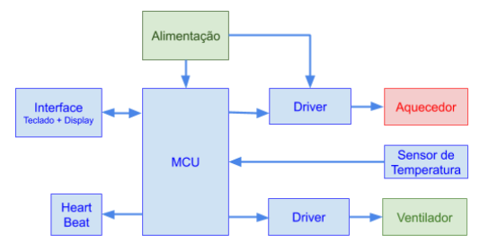
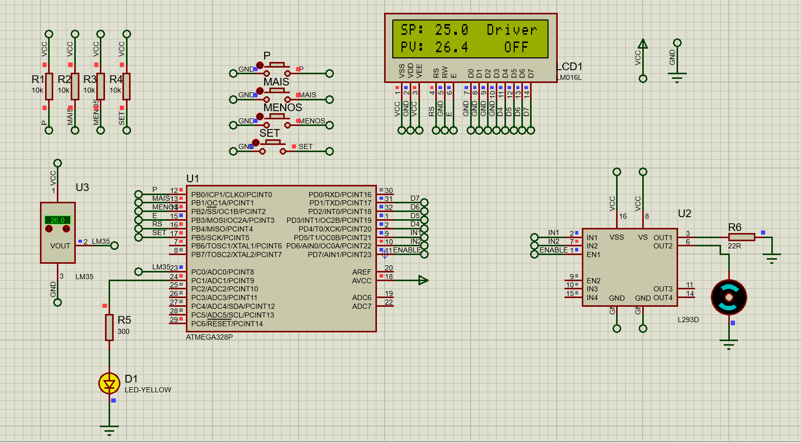

# Sistema de Controle de Temperatura

   

* **Descrição do projeto:**
 
 O sistema foi projetado para controlar a temperatura de um ambiente, utilizando um controlador do tipo Proporcional. A interface do usuário é composta por um display LCD 16x2 e quatro botões de controle. O sistema contém algumas telas, tais como:
 * Main Screen: Mostra a temperatura desejada (setpoint), temperatura atual, estado do sistema (Driver, Heat e Fan como ON ou OFF).
 * New Set Point: Configura a nova temperatura desejada.
 * New Gain F e H: Configura o ganho do Fan e do Heat (ventilador e aquecedor).
 * Manual Mode: Override do driver para ativar ou o Fan ou o Heat manualmente.
 * Se o Manual Mode for ativado, aparecerão duas novas telas: Heat Manual e Fan Manual, onde se pode ativar ou desativar um dos dois, e também controlar a intensidade (PWM) independente da temperatura, porém, enquanto um está ligado, o outro DEVE estar desligado.
 * Driver Status: Ativa ou desativa o controlador de calor.
 
  Além disso, existe um LED para indicação de funcionamento do driver (heartbeat). Quando o driver está ON, o led pisca a cada 500ms. Se o driver está OFF, o LED fica aceso indeterminadamente. O projeto foi desenvolvido utilizando a Sloeber IDE.
  
 * **Material Utilizado:**
 
  Alguns dos materiais utilizados para realização do projeto foram:
  
  * Arduino UNO
  * Protoboard + fios + resistores + botoes + leds
  * Display LCD 16x2
  * Cooler 12V
  * Resistor 22ohms 1/2W
  * Sensor de temperatura LM35
  * Ponte H L239D
 
* **Fotos:**

   

